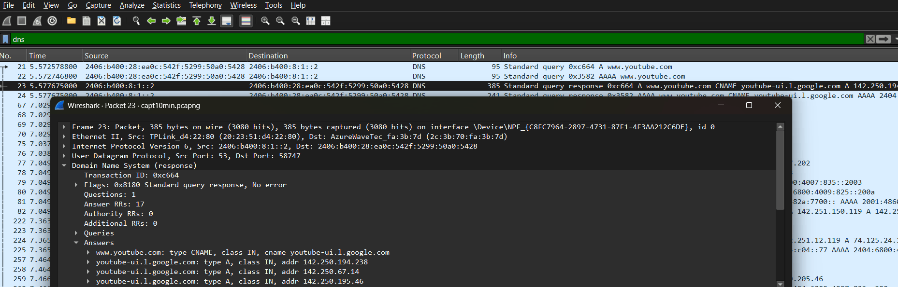
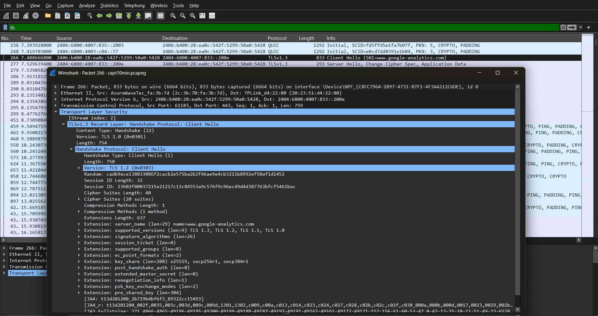
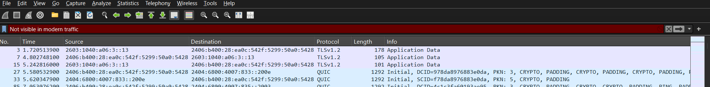
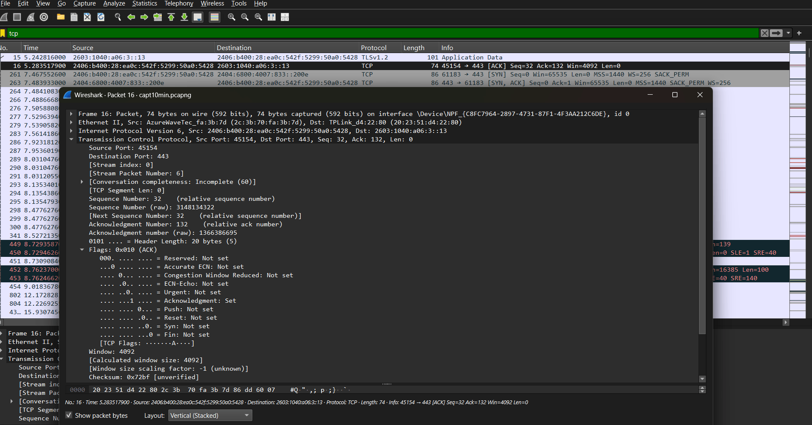
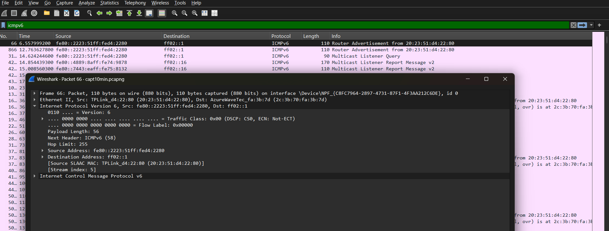
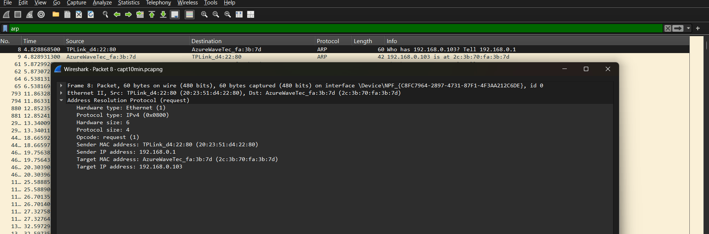
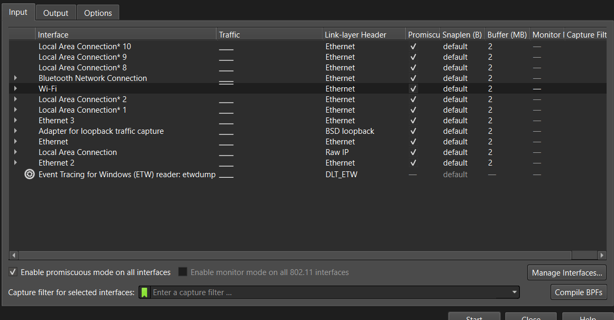

# Day 1 — OSI Model + Wireshark Live Capture

## Objective
Identify one real packet/protocol per OSI layer from a 10-minute live Wireshark capture.
Map real-world traffic to the theoretical OSI model — not just diagrams.

## Capture Details
- **Duration:** 10 minutes
- **File:** `capt10min.pcapng`
- **Tool:** Wireshark
- **Date:** 2026-06-09

---

## OSI Layer Evidence (from live capture)

| Layer | Name | Protocols Found | Notes |
|-------|------|-----------------|-------|
| 7 | Application | HTTP, DNS, LLMNR, SSDP | LLMNR (UDP 5355) is a real attack surface — vulnerable to LLMNR Poisoning via Responder tool. SSDP = UPnP device discovery (UDP 1900). |
| 6 | Presentation | TLS | Observed in HTTPS sessions. TLS handshake (Client Hello, Server Hello) visible even though payload is encrypted. |
| 5 | Session | *(not visible)* | No distinct L5 protocol appeared — normal for modern TCP/IP. Session management is absorbed into TLS and application logic. |
| 4 | Transport | TCP, UDP, QUIC | TCP = reliable, connection-oriented (SYN/ACK visible). UDP = connectionless, seen under DNS/LLMNR/SSDP. QUIC = Google's protocol over UDP, seen in Chrome traffic. |
| 3 | Network | ICMP, IGMP | ICMP = ping/traceroute signalling. IGMP = multicast group management, seen alongside SSDP multicast. |
| 2 | Data Link | ARP | Maps IP → MAC. ARP requests/replies visible in plaintext — classic ARP spoofing attack surface. |
| 1 | Physical | *(Ethernet/Wi-Fi)* | Wireshark operates above L1 — but every captured frame travels over a physical medium (Wi-Fi adapter). |

---

## Key Observations
- **LLMNR** was the most interesting find — it's a real lateral movement attack vector I hadn't studied yet
- **QUIC** was unexpected — shows how Chrome bypasses traditional TCP+TLS stacks entirely
- **Layer 5 was empty** — confirmed this is normal and shows understanding, not a gap
- **ARP** is completely unencrypted — every request visible in plaintext, which is why ARP spoofing is so effective

---

## Screenshots
See annotated screenshots below — one per OSI layer.

### Layer 7 — Application (HTTP, DNS, LLMNR, SSDP)

> Filter used: `http or dns or udp.port==5355 or udp.port==1900`

### Layer 6 — Presentation (TLS)

> Filter used: `tls` — Client Hello packet expanded showing TLS Record Layer

### Layer 5 — Session (Not Visible)

> No distinct session-layer protocol in modern TCP/IP traffic — this is expected

### Layer 4 — Transport (TCP, UDP, QUIC)

> Filter used: `tcp` — SYN packet expanded showing flags

### Layer 3 — Network (ICMP, IGMP)

> Filter used: `icmp or igmp` — IP header showing src/dst addresses

### Layer 2 — Data Link (ARP)

> Filter used: `arp` — ARP request showing MAC addresses in plaintext

### Layer 1 — Physical (Wi-Fi/Ethernet)

> Wireshark capture interface screen showing physical adapter in use

---

## What I Learned Today
- The OSI model isn't just theory — every protocol I use daily maps to a specific layer
- LLMNR and SSDP are noisy protocols that create real attack surfaces on local networks
- Wireshark makes the invisible visible — I can now read raw network traffic
