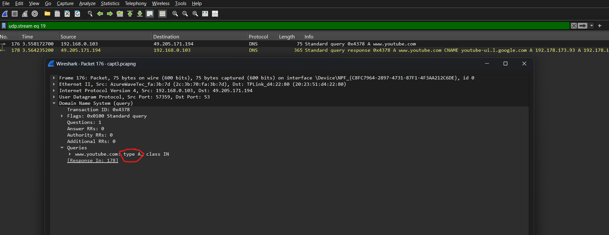
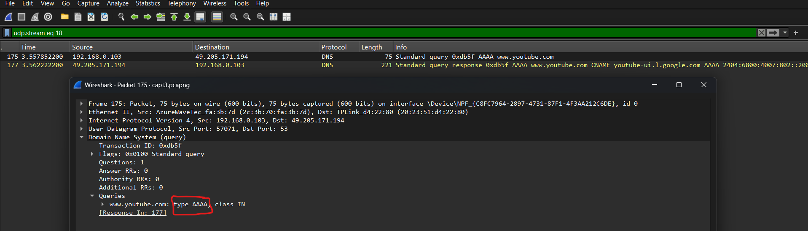
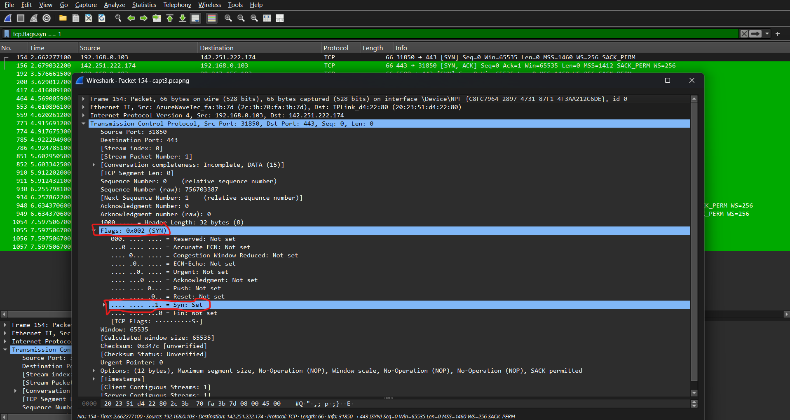

# Day 2 — TCP/IP Model + Wireshark YouTube.com Capture

## Objective
Understand the TCP/IP 4-layer model, capture real traffic to youtube.com,
observe DNS resolution, TCP handshake, and QUIC video delivery — all in one capture.

## Capture Details
- **File:** `capt3.pcapng`
- **Tool:** Wireshark
- **Target:** youtube.com
- **Date:** 2026-06-10

---

## OSI vs TCP/IP — Side by Side

| OSI Layer | OSI Name | TCP/IP Layer | TCP/IP Name | Protocols |
|-----------|----------|-------------|-------------|-----------|
| 7 | Application | 4 | Application | HTTP, DNS, QUIC |
| 6 | Presentation | 4 | Application | TLS |
| 5 | Session | 4 | Application | TLS |
| 4 | Transport | 3 | Transport | TCP, UDP |
| 3 | Network | 2 | Internet | IP, ICMP |
| 2 | Data Link | 1 | Network Access | Ethernet, ARP |
| 1 | Physical | 1 | Network Access | Wi-Fi, Ethernet |

> Key difference: TCP/IP collapses OSI's 7 layers into 4.
> Layers 5, 6, 7 of OSI all map to a single Application layer in TCP/IP.

---

## What Happened When I Visited YouTube.com

### Step 1 — DNS Resolution (UDP)
Before any connection, the browser needed to find YouTube's IP address.
- **A record** = IPv4 address query
- **AAAA record** = IPv6 address query
- Transport used: **UDP port 53** — no handshake, just 2 packets per query
- DNS over **HTTPS** also observed — queries hidden inside encrypted traffic

### Step 2 — TCP Handshake
Once the IP was known, browser established a TCP connection:
- 3 packets to complete
- No data transferred yet — just connection setup
- Sequence numbers assigned during this phase

### Step 3 — QUIC Video Delivery
After the TCP handshake, YouTube switched to QUIC for actual video:
- QUIC combines TCP reliability + TLS encryption over UDP
- Avoids Head of Line Blocking — video keeps flowing even if a packet is lost
- Wireshark shows this as **QUIC IETF** rows

---

## Packet Flow Summary

| Step | Protocol | Layer | What happened |
|------|----------|-------|---------------|
| 1 | DNS (UDP) | L7 over L4 | Queried A + AAAA records for youtube.com |
| 2 | DNS over HTTPS | L7 over L4 | Encrypted DNS query inside HTTPS |
| 3 | TCP SYN | L4 | Started TCP connection to YouTube server |
| 4 | TCP SYN-ACK | L4 | YouTube acknowledged connection |
| 5 | TCP ACK | L4 | Handshake complete |
| 6 | TLS Hello | L6 | Encryption negotiation |
| 7 | QUIC IETF | L4+L6 | Video data delivered over UDP port 443 |

---

## Key Observations
- **A + AAAA both queried** — browser checks for both IPv4 and IPv6 automatically
- **DNS over HTTPS appeared** — Chrome hides some DNS inside HTTPS (DoH)
- **QUIC replaced TCP for video** — YouTube doesn't use plain TCP once connection is established
- **UDP port 443 = QUIC** — same port as HTTPS but UDP instead of TCP

---

## Screenshots
See `/screenshots/` folder.

### DNS Query — A Record

> Filter used: `dns` — showing A record query and response for youtube.com

### DNS Query — AAAA Record

> Filter used: `dns` — showing AAAA record query and response for youtube.com

### TCP 3-Way Handshake

> Filter used: `tcp.flags.syn==1` — showing SYN, SYN-ACK, ACK sequence

### QUIC Video Delivery

> Filter used: `quic` — showing QUIC IETF packets over UDP port 443

---

## What I Learned Today
- TCP/IP is what actually runs the internet — OSI is the theory, TCP/IP is the practice
- A single page visit triggers DNS → TCP → TLS → QUIC automatically
- YouTube uses QUIC specifically to avoid buffering — UDP's speed beats TCP for video
- DNS queries happen before anything else — without DNS, no connection is possible
