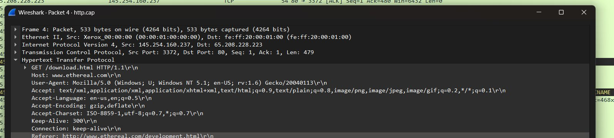

# Week 2 — Day 1: HTTP Deep Dive + PCAP Analysis

## Objective
Download a sample HTTP PCAP from Wireshark's sample captures, analyze it with no filters first to test recognition skills, then verify findings using display filters.

## File Analyzed
`http.cap` — Wireshark sample capture (43 packets total)

## Initial Observations (No Filters)

Reading the packet list top to bottom without any filtering:

- Capture begins with a standard **TCP 3-way handshake** between client `145.254.160.237` and server `65.208.228.223` on port 80 (HTTP).
- After the handshake, the client sends a **PSH, ACK** packet containing an HTTP **GET** request.
- The server's response comes back across **multiple TCP segments** — the response body (an HTML page) was too large for a single packet, so it was split and reassembled by the TCP stack before Wireshark/the application layer could read it as one logical HTTP response.
- A **DNS query and response** for `pagead2.googlesyndication.com` appears mid-capture — an ad request triggered by the page itself, on a separate connection.
- A second TCP conversation (port 3371 ↔ `216.239.59.99`) runs in parallel — this is the ad server connection, separate from the main page request.
- Capture ends with a standard **TCP teardown** (FIN/ACK exchanges).

## Verification Using Filters

| Filter | Purpose | What It Revealed |
|---|---|---|
| `tcp.flags.syn==1` | Isolate handshake | Confirmed SYN → SYN-ACK → ACK sequence opening the connection |
| `http.request` | Isolate HTTP requests | Found exactly one GET request: `GET /download.html HTTP/1.1` |
| `http.response` | Isolate HTTP responses | Found one `HTTP/1.1 200 OK` response, body reassembled from multiple segments |
| `dns` | Isolate DNS traffic | Found query for `pagead2.googlesyndication.com` and its answer |
| `tcp.flags.fin==1` | Isolate teardown | Confirmed FIN/ACK exchange closing the main connection |

## HTTP Request Details (Packet 4)

```
GET /download.html HTTP/1.1
Host: www.ethereal.com
User-Agent: Mozilla/5.0 (Windows; U; Windows NT 5.1; en-US; rv:1.6) Gecko/20040113
Accept: text/xml,application/xml,application/xhtml+xml,text/html;q=0.9,...
Accept-Language: en-us,en;q=0.5
Accept-Encoding: gzip,deflate
Accept-Charset: ISO-8859-1,utf-8;q=0.7,*;q=0.7
Keep-Alive: 300
Connection: keep-alive
Referer: http://www.ethereal.com/development.html
```

**Key findings:**
- **Browser identified:** Mozilla Firefox (Gecko engine, rv:1.6 — an early Firefox/Mozilla Suite build)
- **Page requested:** `/download.html`
- **Host:** `www.ethereal.com` (Ethereal was Wireshark's original project name pre-2006 rename)
- **Referer:** shows the user navigated here from `development.html` — useful for reconstructing browsing path

### Screenshot — Packet 4 Detail View



**Annotation:**
- Frame 4, 533 bytes on wire, source port 3372 → destination port 80 (HTTP)
- `Transmission Control Protocol` layer confirms `Seq: 1, Ack: 1, Len: 479` — this is the segment carrying the HTTP request payload
- `Hypertext Transfer Protocol` layer expanded shows the full raw GET request exactly as parsed above — Host, User-Agent, Accept*, Keep-Alive, Connection, and Referer headers all visible in order
- This is the layered view Wireshark gives by default: Ethernet → IP → TCP → HTTP, each protocol's header parsed and shown before the next layer up — a good visual reinforcement of encapsulation (Week 1 OSI concept) applied to a real capture

## HTTP Response Details (Packet 6 onward, reassembled)

```
HTTP/1.1 200 OK
Date: Thu, 13 May 2004 10:17:12 GMT
Server: Apache
Last-Modified: Tue, 20 Apr 2004 13:17:00 GMT
ETag: "9a01a-4696-7e354b00"
Accept-Ranges: bytes
Content-Length: 18070
Keep-Alive: timeout=15, max=100
Connection: Keep-Alive
Content-Type: text/html; charset=ISO-8859-1
```

**Key findings:**
- **Status code:** 200 OK — request succeeded
- **Server software:** Apache
- **Content-Length:** 18,070 bytes — explains why the response needed multiple TCP segments to arrive, then reassembly
- **Content-Type:** `text/html` — confirms the response body is an HTML page

## Correction / Lesson Learned

Initially mixed up which headers belonged to the request vs. the response. Clarified:
- **Request headers:** Host, User-Agent, Accept, Accept-Language, Accept-Encoding, Accept-Charset, Keep-Alive, Connection, Referer
- **Response headers:** Date, Server, Last-Modified, ETag, Accept-Ranges, Content-Length, Keep-Alive, Connection, Content-Type

Same header *names* can appear on both sides (e.g., `Keep-Alive`, `Connection`), but `Date`/`Server`/`ETag`/`Content-Length` are response-only in this exchange — important distinction for accurate packet annotation going forward.

## Skills Reinforced
- Reading raw HTTP requests/responses inside a TCP stream
- Understanding TCP segmentation/reassembly for large HTTP bodies
- Differentiating request headers from response headers
- Using Wireshark display filters to verify manual observations
