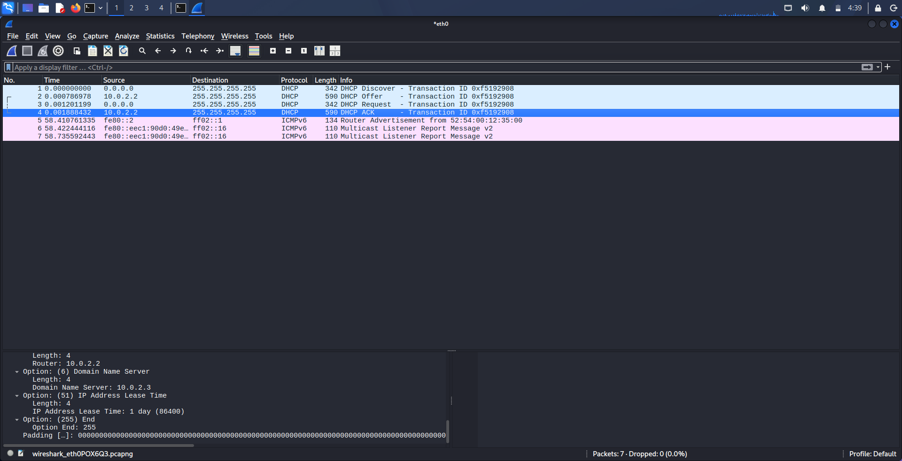

# DHCP DORA Lab — Week 2, Day 2

Captured and annotated a full DHCP DORA exchange in Wireshark while running `dhclient` on the Kali VM (NAT-connected interface, `eth0`).

## Setup

- Wireshark capturing on `eth0`, display filter: `dhcp` (Wireshark labels these packets as BOOTP/DHCP under the hood).
- Forced a fresh lease negotiation with:
  ```
  sudo dhclient -r eth0
  sudo dhclient -v eth0
  ```
- All four packets share the same DHCP Transaction ID (`0xf5192908`), confirming they belong to one coherent exchange.



## Captured Packets

| # | Time (s) | Source | Destination | Message | Notes |
|---|----------|--------|-------------|---------|-------|
| 1 | 0.000000 | 0.0.0.0 | 255.255.255.255 | DHCP Discover | Client has no IP yet, broadcasts to find a DHCP server. Requests options: subnet mask, DNS server, domain name, router. |
| 2 | 0.000787 | 10.0.2.2 | 255.255.255.255 | DHCP Offer | Server proposes a lease. Includes Router (10.0.2.2), Domain Name Server (10.0.2.3), Lease Time (86400s / 1 day). |
| 3 | 0.001201 | 0.0.0.0 | 255.255.255.255 | DHCP Request | Client broadcasts acceptance of the offered lease. |
| 4 | 0.001888 | 10.0.2.2 | 255.255.255.255 | DHCP ACK | Server finalizes the lease with the same option set (IP, subnet mask, router, DNS, lease time). |

## Observations

- **Source/destination ports:** consistent with the DHCP spec — client always uses source port 68, server always uses source port 67.
- **Server Host Name / Boot File Name fields:** both empty in this capture. These fields exist to support PXE network booting (telling a client which TFTP server and boot file to use for diskless/network boot). Since this is an ordinary lease request, not a PXE boot, the server had no reason to populate them.
- **Router and DHCP server are the same address (10.0.2.2):** this is expected and is actually a strong signal of the environment rather than a coincidence. `10.0.2.x` is VirtualBox's default NAT network range — when a VM uses NAT mode, VirtualBox itself acts as a virtual router *and* DHCP server simultaneously. `10.0.2.2` is VirtualBox's virtual gateway; `10.0.2.3` (seen as the DNS server) is VirtualBox's built-in DNS proxy.
- This confirms the capture was taken on the **NAT-connected interface**, separate from the Host-Only network where Metasploitable2 lives (192.168.56.101).
- Generalizing beyond this specific lab: it's common in real networks for consumer routers/ISP gear to bundle DHCP server functionality into the same device as the gateway — this capture is a literal, virtualized example of that same pattern.

## Why this matters for security

This exchange is the trusted baseline for what *normal* DHCP traffic looks like — useful context for later recognizing **DHCP starvation** (a flood of Discover packets from spoofed MAC addresses exhausting the address pool) or a **rogue DHCP server** (multiple Offer packets for the same Discover, from different server IPs, handing out a malicious gateway or DNS server to the victim).
