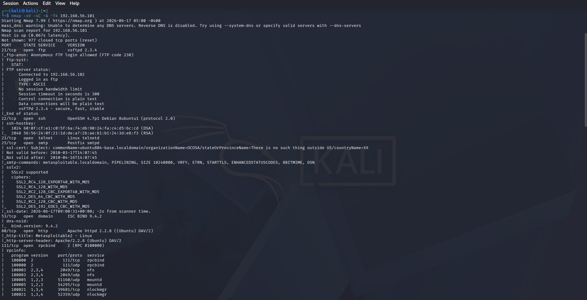
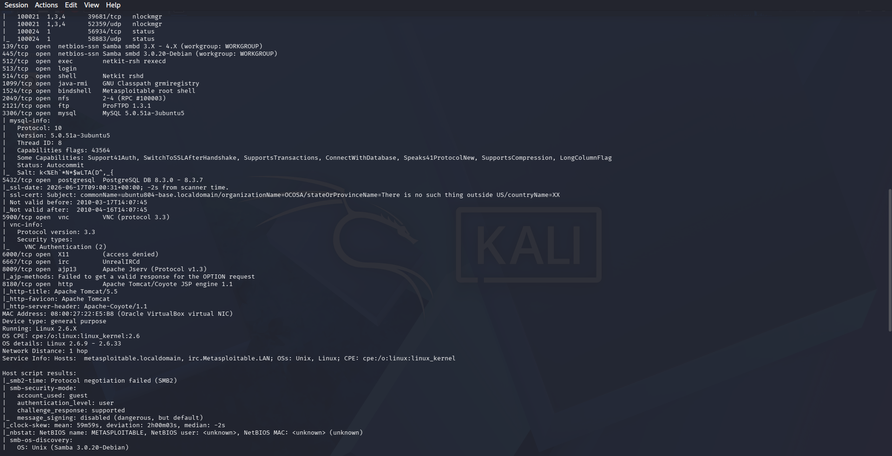

# Nmap Scan — Metasploitable2 — Week 2, Day 2

## Command

```
nmap -sV -sC -A -T4 192.168.56.101
```

Full output saved to `scan.txt` via `nmap -oN scan.txt`.





## Host Summary

- **Target:** 192.168.56.101 (Metasploitable2)
- **OS:** Linux 2.6.9 – 2.6.33
- **MAC Address:** 08:00:27:22:E5:B8 (Oracle VirtualBox virtual NIC)
- **NetBIOS name:** METASPLOITABLE
- **977 closed TCP ports** (reset), remainder open as detailed below.

## Open Ports & Findings

| Port | Service | Version | Key Finding |
|------|---------|---------|--------------|
| 21/tcp | FTP | vsftpd 2.3.4 | **Anonymous login allowed** (FTP code 230). Control and data connections both plain text. This exact version has a known backdoor (CVE-2011-2523). |
| 22/tcp | SSH | OpenSSH 4.7p1 Debian 8ubuntu1 (protocol 2.0) | Host keys revealed (DSA 1024-bit, RSA 2048-bit). |
| 23/tcp | Telnet | Linux telnetd | Inherently insecure — transmits all data, including credentials, in plaintext, regardless of version. |
| 25/tcp | SMTP | Postfix smtpd | Supports **SSLv2** (deprecated, cryptographically broken protocol) with weak ciphers (e.g. `SSL2_RC4_128_WITH_MD5`). SSL certificate **expired in 2010** (`Not valid after: 2010-04-16`). |
| 53/tcp | DNS | ISC BIND 9.4.2 | Scan only reflects the TCP-facing DNS service — most real-world DNS traffic runs over UDP, which a TCP-only scan does not enumerate. |
| 80/tcp | HTTP | Apache httpd 2.2.8 (Ubuntu) DAV/2 | Page title: "Metasploitable2 - Linux". |
| 111/tcp | rpcbind | 2 (RPC #100000) | Exposes RPC service registry (mountd, nlockmgr, status, nfs) — see RPC table below. |
| 139/tcp | netbios-ssn | Samba smbd 3.X – 4.X (workgroup: WORKGROUP) | Two different Samba version bands reported across 139 and 445 — worth further investigation. |
| 445/tcp | netbios-ssn | Samba smbd 3.0.20-Debian (workgroup: WORKGROUP) | SMB host script results: guest account access permitted, message signing **disabled** (flagged by nmap as "dangerous, but default"). |
| 512/tcp | exec | netkit-rsh rexecd | Legacy Unix "r-services" — remote execution with no encryption, predates SSH. |
| 513/tcp | login | (rlogin) | Remote login service, not a web login page. Plaintext, can rely on host-based trust instead of passwords. |
| 514/tcp | shell | Netkit rshd | Remote shell daemon, pairs with rexecd/rlogin — same legacy r-services family. |
| 1099/tcp | java-rmi | GNU Classpath grmiregistry | Java RMI registry — can potentially be abused for remote class loading attacks. |
| 1524/tcp | bindshell | Metasploitable root shell | **Unauthenticated root shell** listening directly — a deliberately left-open backdoor from a prior exploit, severe finding. |
| 2049/tcp | nfs | 2-4 (RPC #100003) | Network File System — check exported shares for overly permissive access. |
| 2121/tcp | ftp | ProFTPD 1.3.1 | A **second, separate FTP daemon** distinct from vsftpd on port 21 — two different FTP implementations running simultaneously. |
| 3306/tcp | mysql | MySQL 5.0.51a-3ubuntu5 | Protocol 10, supports legacy auth/compression capability flags. |
| 5432/tcp | postgresql | PostgreSQL DB 8.3.0 – 8.3.7 | SSL certificate present but **expired in 2010** (same expiry as the SMTP cert — same underlying base image). |
| 5900/tcp | vnc | VNC (protocol 3.3) | Weak/legacy "VNC Authentication (2)" scheme. |
| 6000/tcp | X11 | — | Access denied on probe, but the port being open at all is notable. |
| 6667/tcp | irc | UnrealIRCd | Certain UnrealIRCd versions have a known backdoor — worth checking the specific build. |
| 8009/tcp | ajp13 | Apache Jserv Protocol v1.3 | AJP — the protocol associated with the Ghostcat vulnerability in vulnerable Tomcat configurations. |
| 8180/tcp | http | Apache Tomcat/Coyote JSP engine 1.1 | Page title: "Apache Tomcat/5.5". |

## RPC Services (via rpcbind, port 111)

| Program | Version | Port/Proto | Service |
|---------|---------|------------|---------|
| 100000 | 2 | 111/tcp, 111/udp | rpcbind |
| 100003 | 2,3,4 | 2049/tcp, 2049/udp | nfs |
| 100005 | 1,2,3 | 51160/udp, 54295/tcp | mountd |
| 100021 | 1,3,4 | 39681/tcp, 52359/udp | nlockmgr |
| 100024 | 1 | 56934/tcp, 58883/udp | status |

## Host Script Results (SMB)

- `smb2-time`: protocol negotiation failed (SMB2 not supported/enabled).
- Guest account usable, authentication level: user.
- Challenge/response authentication supported.
- **Message signing disabled** — flagged by nmap as dangerous, but the default configuration.
- Clock skew: mean 59m59s (notably large — worth investigating in a real assessment).

## Why This Matters

This scan is reconnaissance — the step before exploitation. The combined picture (anonymous FTP, an unauthenticated root bind shell, expired certificates, SSLv2 support, disabled SMB signing, legacy r-services with no encryption) shows Metasploitable2 deliberately stacked with severe, low-effort entry points, useful for practicing how a pentester would prioritize targets: the bind shell on 1524 and anonymous FTP on 21 are the most immediately exploitable findings here, with no authentication bypass required at all.

## Corrections from initial notes

- Port 513 service is `login` (rlogin), not a web login page.
- Port 80 page title is exactly "Metasploitable2 - Linux", not "metasploitable-2".
- Port 25's script output (ciphers, cert expiry) was specifically under the `sslv2` heading — the finding is "supports the broken SSLv2 protocol," not encryption support in general.
