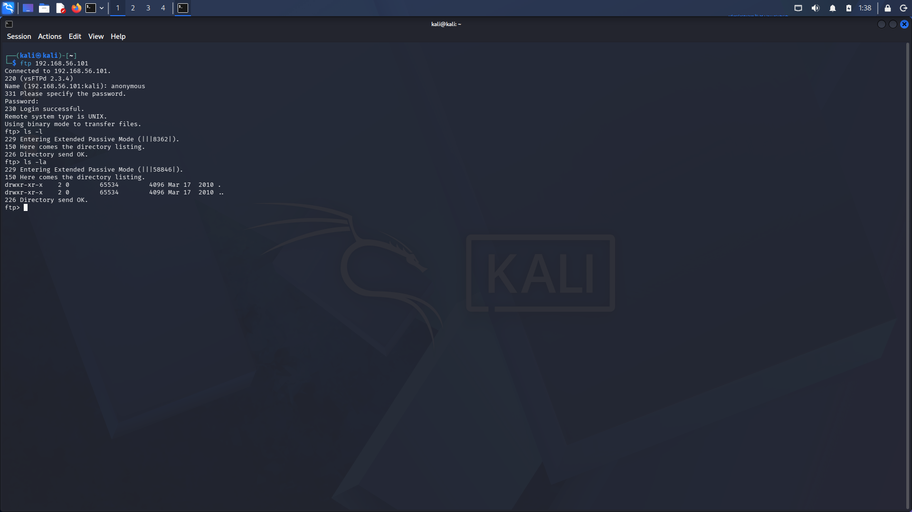

# FTP Anonymous Enumeration — Metasploitable2

**Date:** Week 2, Day 4
**Target:** 192.168.56.101 (Metasploitable2)
**Tools used:** `ftp` client, `nmap --script ftp-anon`
**Service identified:** vsFTPd 2.3.4

---

## 1. Objective

Determine whether the FTP service on Metasploitable2 allows anonymous (unauthenticated) access, and if so, assess the scope of that access — read, write, or both.

---

## 2. Methodology

### Step 1 — Manual connection attempt

```bash
ftp 192.168.56.101
```

```
Connected to 192.168.56.101.
220 (vsFTPd 2.3.4)
Name (192.168.56.101:kali): anonymous
331 Please specify the password.
Password:
230 Login successful.
Remote system type is UNIX.
Using binary mode to transfer files.
```

**Result:** Anonymous login accepted with username `anonymous` and a blank password. No credentials of any kind were required.


*Terminal output showing successful anonymous FTP login and an empty directory listing via `ls -la`.*

### Step 2 — Directory listing

```bash
ftp> ls -la
```

```
229 Entering Extended Passive Mode (|||58846|).
150 Here comes the directory listing.
drwxr-xr-x   2 0        65534        4096 Mar 17  2010 .
drwxr-xr-x   2 0        65534        4096 Mar 17  2010 ..
226 Directory send OK.
```

**Result:** The anonymous FTP root directory is empty (only `.` and `..` present). No files were available to download. This is expected default behavior on a stock Metasploitable2 image — the vulnerability lies in the access control failure itself, not in any specific file exposure.

### Step 3 — Write access test

To determine whether anonymous access is read-only or read-write, a local test file was created and an upload attempted:

```bash
ftp> !echo "anonymous write test" > text.txt
ftp> put text.txt
```

```
229 Entering Extended Passive Mode (|||63010|).
553 Could not create file.
```

**Result:** Upload rejected with `553 Could not create file`. Anonymous write access is **disabled**. This is a genuine server-side response (not a local error), confirming the anonymous account has read-only permissions at most, and in this case, nothing readable was even present.

### Step 4 — Automated verification

```bash
nmap --script ftp-anon -p 21 192.168.56.101
```

*(Output to be pasted here once run — confirms the manual finding programmatically and is the standard tool-based verification step for a SOC/pentest report.)*

---

## 3. Findings Summary

| Test | Result | Severity |
|---|---|---|
| Anonymous login | **Success** (`230 Login successful`) | High — unauthenticated access granted |
| Directory listing | Success, but directory empty | Informational — no data exposed *currently* |
| Anonymous file upload | **Failed** (`553 Could not create file`) | N/A — write access properly restricted |

---

## 4. Why Anonymous FTP Is a Security Risk

1. **Unauthenticated access** — anyone reaching port 21 gets in with no credentials and no identity tied to the session, eliminating accountability/audit trail.
2. **Information disclosure potential** — file listings can reveal directory structure, software versions, or sensitive leftover files (configs, backups, source code) if present.
3. **Write access risk (when enabled)** — if anonymous write were allowed, an attacker could upload malware, webshells (if the FTP root overlaps a web root), or exhaust disk space. This was specifically tested and ruled out here.
4. **Outdated service software** — vsFTPd 2.3.4 is the version associated with a known backdoored-build incident in 2011 (unrelated to anonymous access itself, but relevant given the old version number visible in the banner).
5. **No accountability** — anonymous services are a standard audit/compliance finding (PCI-DSS, ISO 27001) because access cannot be attributed to an individual.

---

## 5. SOC Analyst Interpretation

Anonymous login succeeding is itself the finding, independent of whether interesting files happen to be present. A properly hardened FTP service should reject anonymous authentication outright. The fact that write access is disabled here reduces impact severity from critical to moderate — but the unauthenticated read access itself remains a misconfiguration worth flagging in any real assessment.

---

## 6. Key Commands Reference

| Command | Breakdown |
|---|---|
| `ftp <IP>` | Connects the FTP client to the target |
| `anonymous` / blank password | Standard convention for public/guest FTP access |
| `ls -la` | Lists all files (`-a`, including hidden/dotfiles) in long format (`-l`, permissions/owner/size/date) |
| `!<command>` | Escapes to local shell from within an active `ftp` session without disconnecting |
| `put <file>` | Uploads a local file to the remote server |
| `get <file>` | Downloads a remote file to the local machine |
| `bye` | Closes the FTP session |
| `nmap --script ftp-anon -p 21 <IP>` | Automated check for anonymous FTP login on port 21 |
