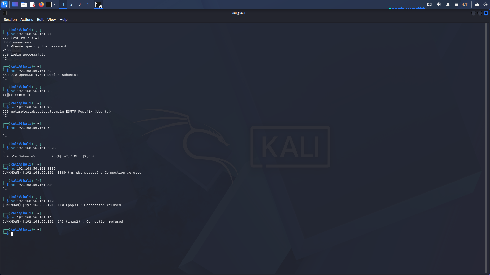
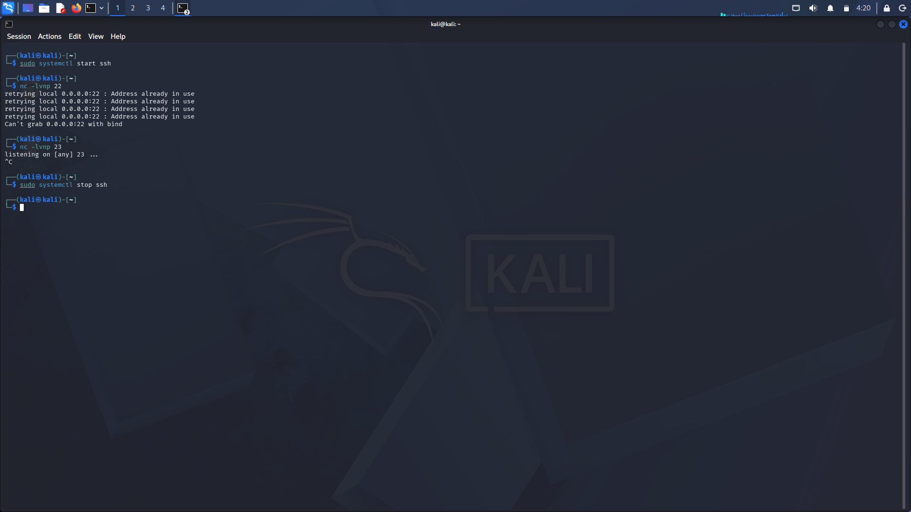

# Netcat (nc) Basics — Banner Grabbing & Listener Mode

**Date:** Week 2, Day 4
**Target:** 192.168.56.101 (Metasploitable2)
**Tool used:** `nc` (netcat), `dig`

---

## 1. Objective

Use netcat as a raw TCP client to manually interact with services and perform banner grabbing, without relying on protocol-specific client tools (`ftp`, `ssh`, etc.). Also use netcat in listening mode to understand the reverse direction — accepting incoming connections — and observe how port binding conflicts occur.

---

## 2. Concept: What netcat actually is

Netcat opens a raw TCP (or UDP) connection between two endpoints with no protocol logic layered on top. Tools like `ftp` and `ssh` are effectively netcat plus a protocol-aware translator built around it, automating what the protocol expects you to say. Netcat strips that translation away — you see and send the raw bytes yourself.

This is why netcat is called **"the Swiss army knife of networking"**: the same small binary, with different flags, performs port scanning, banner grabbing, file transfer, two-way chat sessions, and reverse shells. No single specialized tool covers that range — netcat's value is its generality at the raw socket level.

---

## 3. Banner Grabbing — Manual Connections

Connecting to a port with netcat and simply observing what the service says first reveals exact software and version information, without needing nmap or any other scanner.

### Port 21 — FTP

```bash
nc 192.168.56.101 21
```

```
220 (vsFTPd 2.3.4)
USER anonymous
331 Please specify the password.
PASS
230 Login successful.
```

Confirms vsFTPd 2.3.4 (matches earlier FTP enumeration findings) and demonstrates the full anonymous login handshake performed manually, command by command, instead of through the `ftp` client.

### Port 22 — SSH

```bash
nc 192.168.56.101 22
```

```
SSH-2.0-OpenSSH_4.7p1 Debian-8ubuntu1
```

Confirms OpenSSH 4.7p1 (matches earlier SMB/CVE findings). SSH does not accept further plaintext commands after the banner — it expects binary protocol negotiation, so the connection was closed manually after capturing the banner.

### Port 23 — Telnet

```bash
nc 192.168.56.101 23
```

```
♦♦█♦♦ ♦♦#♦♦'
```

No readable banner — instead, raw Telnet terminal-negotiation control bytes were returned. This happens because Telnet servers may send protocol negotiation sequences before any human-readable text, and plain `nc` does not know how to interpret or respond to those bytes the way a proper `telnet` client would. The garbled output is expected behavior, not a failed connection.

### Port 25 — SMTP

```bash
nc 192.168.56.101 25
```

```
220 metasploitable.localdomain ESMTP Postfix (Ubuntu)
```

Confirms the mail service is Postfix on Ubuntu, with hostname `metasploitable.localdomain`. Postfix's default banner does not include a specific version number — further enumeration (e.g., `nmap --script smtp-enum-users` or examining installed package metadata directly) would be needed to extract one.

### Port 53 — DNS (no banner via nc)

```bash
nc 192.168.56.101 53
```

No response. DNS does not use a "speak first" banner model like FTP/SSH/SMTP — it requires a properly structured query before returning anything. Netcat alone cannot retrieve version information here.

**Correct tool: `dig` with a CHAOS-class TXT query**

```bash
dig @192.168.56.101 version.bind chaos txt
```

```
;; ANSWER SECTION:
version.bind.           0       CH      TXT     "9.4.2"
```

This confirms **ISC BIND 9.4.2** via the special `version.bind` CHAOS-class diagnostic query that BIND servers respond to by design. The response also indicated the server is authoritative-only (recursion requested but not available).

### Port 3306 — MySQL (bonus finding)

```bash
nc 192.168.56.101 3306
```

```
5.0.51a-3ubuntu5    [binary handshake data]
```

MySQL also announces its version on connection. Confirmed: **MySQL 5.0.51a-3ubuntu5**. The garbled text following the version string is the protocol's binary authentication handshake data (salt/challenge bytes), not an error.

### Other ports tested

| Port | Service | Result |
|---|---|---|
| 80 | HTTP | Connected, no banner — HTTP servers wait for the client to send a request first (`GET / HTTP/1.1`) rather than greeting on connect |
| 110 | POP3 | Connection refused — not running on this target |
| 143 | IMAP | Connection refused — not running on this target |
| 3389 | RDP | Connection refused — not running on this target |


*Terminal output showing raw `nc` connections to ports 21, 22, 23, 25, 53, 3306, 3389, 80, 110, and 143, capturing banners and refusals.*

---

## 4. Listening Mode

```bash
nc -lvnp 4444
```

| Flag | Meaning |
|---|---|
| `-l` | Listen mode — wait for an incoming connection instead of initiating one |
| `-v` | Verbose — report connection details |
| `-n` | No DNS resolution — display raw IPs only |
| `-p 4444` | Bind and listen on port 4444 |

### Observed port-binding conflict

```bash
sudo systemctl start ssh
nc -lvnp 22
```

```
retrying local 0.0.0.0:22 : Address already in use
Can't grab 0.0.0.0:22 with bind
```

The real `sshd` service was already bound to port 22, so netcat could not also bind to the same port. Only one process can hold a given port on a host at a time — this is a fundamental TCP/IP networking constraint, not a netcat-specific limitation.

```bash
nc -lvnp 23
```

```
listening on [any] 23 ...
```

This succeeded, since nothing else was using port 23 on the Kali machine. The session was manually closed (`Ctrl+C`).

```bash
sudo systemctl stop ssh
```

The temporarily started SSH service was cleanly stopped afterward.

**Operational takeaway:** "Address already in use" errors should prompt checking what's already bound to that port (`sudo ss -tlnp | grep :<port>` or `sudo lsof -i :<port>`) before assuming the new service itself is broken.


*Terminal output showing `nc -lvnp 22` failing due to `sshd` already bound to the port, followed by a successful listener on port 23.*

---

## 5. Why Netcat Is Called "The Swiss Army Knife of Networking"

| Use case | Command pattern |
|---|---|
| Port scanning | `nc -zv <IP> <port-range>` |
| Banner grabbing | `nc <IP> <port>` |
| File transfer | `nc -l -p 4444 > file` (receiver) + `nc <IP> 4444 < file` (sender) |
| Raw protocol interaction | `nc <IP> <port>` then type manually |
| Listener / reverse shell catcher | `nc -lvnp 4444` |
| Port forwarding / relaying | combined with redirection or named pipes |

One small static binary performs all of the above by changing only its flags — this breadth, spanning diagnostics through to exploitation tooling (e.g., the vsftpd backdoor's shell on port 6200 is functionally a raw netcat-style connection), is the basis for the nickname.

---

## 6. Key Commands Reference

| Command | Breakdown |
|---|---|
| `nc <IP> <port>` | Opens a raw TCP connection to a target port |
| `nc -lvnp <port>` | Listens for an incoming connection on the given port |
| `dig @<IP> version.bind chaos txt` | Queries a DNS server's own version string via the CHAOS class |
| `sudo ss -tlnp \| grep :<port>` | Lists which process is bound to a given port (useful for "Address already in use" errors) |
