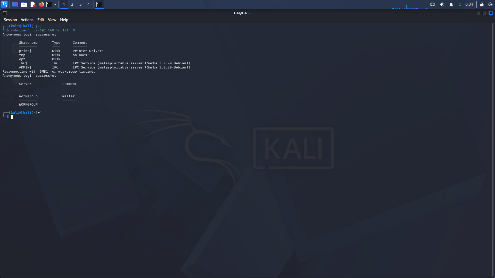
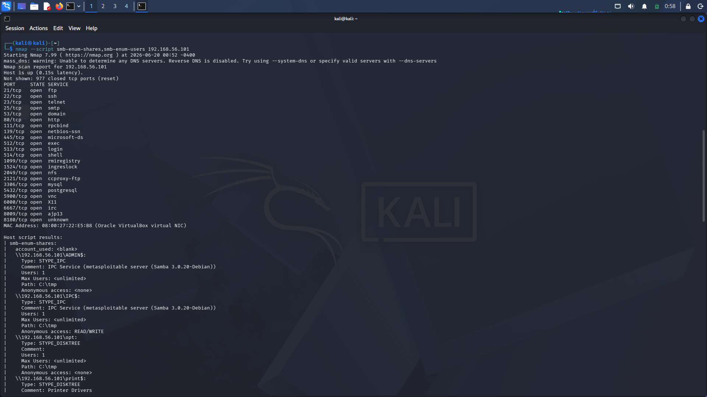
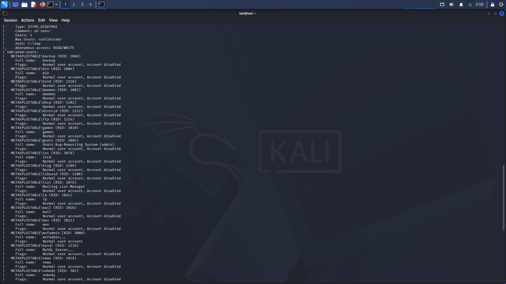
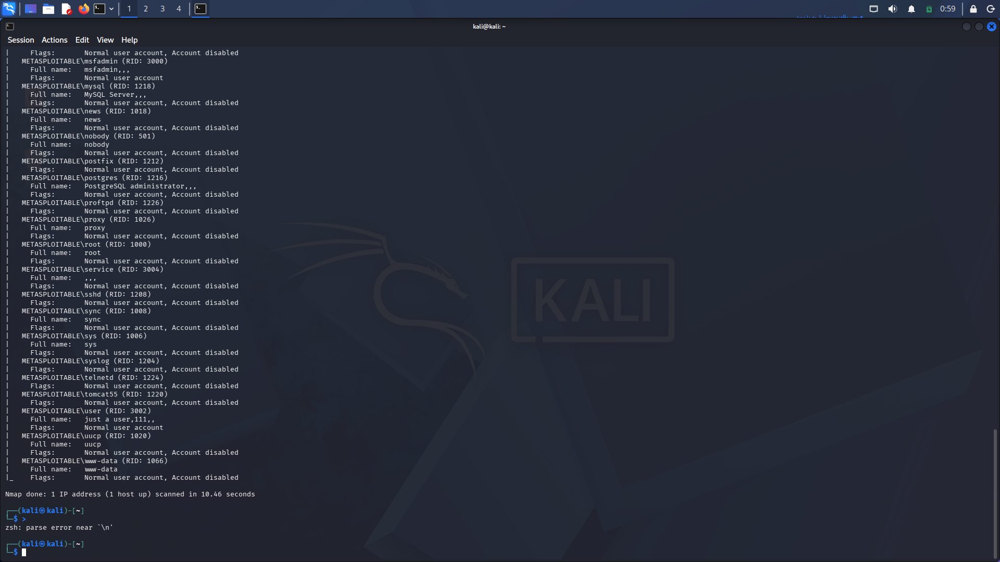

# SMB Enumeration — Metasploitable2

**Date:** Week 2, Day 4
**Target:** 192.168.56.101 (Metasploitable2)
**Tools used:** `smbclient`, `nmap --script smb-enum-shares,smb-enum-users`, `nmap --script smb-vuln-*`
**Service identified:** Samba 3.0.20-Debian

---

## 1. Objective

Enumerate SMB shares exposed by Metasploitable2 over an anonymous (null) session, identify accessible files, enumerate user accounts on the system, and check for known SMB vulnerabilities tied to the Samba version in use.

---

## 2. Methodology

### Step 1 — List shares anonymously

```bash
smbclient -L //192.168.56.101 -N
```

- `-L` = list shares available on the target
- `-N` = no password (attempt a null/anonymous session)

**Result:** Anonymous session succeeded. Shares returned:

| Share | Type | Notes |
|---|---|---|
| `print$` | Disk | Printer driver share — normally restricted, accessible here |
| `tmp` | Disk | World-readable/writable temp folder |
| `opt` | Disk | Optional software directory exposed |
| `IPC$` | IPC | Inter-process communication, used for null sessions (normal, but flagged here as READ/WRITE) |
| `ADMIN$` | IPC | Administrative share — should never be anonymously accessible (confirmed blocked) |

Server comment string identified the backend as **Samba 3.0.20 on Debian** — an end-of-life version with a known unauthenticated RCE (CVE-2007-2447, via the `username map script` parameter).


*Output of `smbclient -L //192.168.56.101 -N` showing successful anonymous login and the full share list, including the workgroup listing after reconnecting via SMB1.*

### Step 2 — Connect to the `tmp` share

```bash
smbclient //192.168.56.101/tmp -N
smb: \> ls
```

```
Current directory is \\192.168.56.101\tmp\
  .                                   D        0  Sat Jun 20 00:44:26 2026
  ..                                 DR        0  Sun May 20 14:36:12 2012
  4873.jsvc_up                        R        0  Sat Jun 20 00:29:32 2026
  .ICE-unix                          DH        0  Sat Jun 20 00:27:40 2026
  .X11-unix                          DH        0  Sat Jun 20 00:28:34 2026
  .X0-lock                           HR       11  Sat Jun 20 00:28:34 2026
```

**File-by-file analysis:**

- **`4873.jsvc_up`** — A flag file created by `jsvc` (a Java Service Wrapper daemon) when a Java-based service starts. The number is the process's PID. Indicates a Java service (likely Tomcat) was running, started at 00:29:32.
- **`.ICE-unix`** (hidden directory) — Inter-Client Exchange socket directory, created by an active X11 graphical session.
- **`.X11-unix`** (hidden directory) — X11 Unix socket directory, confirms a graphical desktop session is active on the target.
- **`.X0-lock`** (hidden, read-only, 11 bytes) — Lock file for X display `:0`, contains the PID of the X server process.

**Evidence summary from `/tmp`:**
- Java service running on the target (PID 4873)
- X11 graphical desktop session active
- Timestamps indicate a recent boot
- Anonymous **write** access to `/tmp` confirmed via share permissions (separate from FTP — this is SMB-level write access, not FTP-level)

### Step 3 — Confirm share permissions and enumerate users via nmap

```bash
nmap --script smb-enum-shares,smb-enum-users 192.168.56.101
```

**Share permission confirmation:**

| Share | Anonymous access | Finding |
|---|---|---|
| `ADMIN$` | None | Correctly blocked |
| `IPC$` | READ/WRITE | Should be read-only at most |
| `opt` | None | Correctly blocked |
| `tmp` | **READ/WRITE** | Critical — full anonymous access, unlimited connections |

**User enumeration results (full list, confirmed via screenshots above):**

| Account | RID | Status | Type |
|---|---|---|---|
| `msfadmin` | 3000 | **Not disabled** | Human login account — high-value target |
| `user` | 3002 | **Not disabled** | Human login account — full name "just a user,111,," |
| `mysql` | 1218 | Account disabled | Service account (MySQL Server) |
| `postgres` | 1216 | Account disabled | Service account (PostgreSQL administrator) |
| `postfix` | 1212 | Account disabled | Service account (mail) |
| `proftpd` | 1226 | Account disabled | Service account (FTP) |
| `tomcat55` | 1220 | Account disabled | Service account (Tomcat) |
| `telnetd` | 1224 | Account disabled | Service account (Telnet) |
| `sshd` | 1208 | Account disabled | Service account (SSH) |
| `bind` | 1210 | Account disabled | Service account (DNS) |
| `dhcp` | 1202 | Account disabled | Service account |
| `distccd` | 1222 | Account disabled | Service account (distributed compilation) |
| `ftp` | 1214 | Account disabled | Service account (FTP) |
| `irc` (ircd) | 1078 | Account disabled | Service account (IRC) |
| `klog` | 1206 | Account disabled | Service account (kernel logging) |
| `syslog` | 1204 | Account disabled | Service account (system logging) |
| `news`, `proxy`, `service`, `sync`, `sys`, `uucp`, `www-data`, `man`, `mail`, `lp`, `list` (Mailing List Manager), `gnats` (Gnats Bug-Reporting System), `games`, `daemon`, `bin`, `backup`, `nobody`, `libuuid`, `root` | various | Account disabled | Standard Linux system/service accounts, none human-operated |

**Important distinction:** "Account disabled" means the account cannot be used for *interactive login* (e.g., SSH). It does **not** mean the associated service is stopped — `mysql` being disabled for login has no bearing on whether MySQL is running on port 3306. Service accounts run their processes in the background entirely independently of login status. This was a point of clarification during analysis and is documented here for future reference.


*Full port scan plus `smb-enum-shares` results, showing the open port list and per-share anonymous access level (`ADMIN$`, `IPC$`, `opt`, `print$`) confirmed via nmap.*


*Beginning of the `smb-enum-users` account list — service accounts (`backup`, `bin`, `bind`, `daemon`, `dhcp`, `distccd`, `ftp`, `games`, `gnats`, `irc`, `klog`, `libuuid`, `list`, `lp`, `mail`, `man`) alongside the first human account, `msfadmin`.*


*Remainder of the `smb-enum-users` account list — `mysql`, `news`, `nobody`, `postfix`, `postgres`, `proftpd`, `proxy`, `root`, `service`, `sshd`, `sync`, `sys`, `syslog`, `telnetd`, `tomcat55`, and the second human account, `user`, plus `uucp` and `www-data`.*

### Step 4 — Full port scan context

A broader scan revealed the full attack surface of the host:

```
21   ftp           — cleartext credentials
22   ssh           — brute-forceable
23   telnet        — cleartext remote login
25   smtp          — mail server exposed
53   domain        — DNS running
80   http          — web app (DVWA)
139  netbios       — SMB companion port
445  microsoft-ds  — SMB (this enumeration)
512  exec          — rexec, no authentication
513  login         — rlogin, no authentication
514  shell         — rsh, no authentication
3306 mysql         — database exposed to network
5432 postgresql    — database exposed to network
5900 vnc           — remote desktop
6000 X11           — confirms .X11-unix finding from /tmp
6667 irc           — IRC server
```

Ports 512/513/514 (rexec/rlogin/rsh) are particularly severe — these protocols have no authentication mechanism at all and would be an immediate critical/P1 finding in a real environment.

### Step 5 — Vulnerability scan

```bash
nmap --script smb-vuln-* 192.168.56.101
```

*(Output to be pasted here once run — expected to flag CVE-2007-2447 given the Samba 3.0.20-Debian version identified.)*

---

## 3. Findings Summary

| Finding | Severity |
|---|---|
| Anonymous (null session) SMB login permitted | High |
| `tmp` share: anonymous READ/WRITE, unlimited connections | Critical |
| `IPC$`: anonymous READ/WRITE (should be read-only) | Medium |
| 2 active human accounts enumerated (`msfadmin`, `user`) without credentials | High |
| Samba 3.0.20-Debian — EOL version, CVE-2007-2447 (unauthenticated RCE) | Critical |
| Java service (Tomcat, likely) and active X11 session confirmed via `/tmp` artifacts | Informational |
| 20+ high-risk services exposed network-wide with no firewall (rsh/rexec/rlogin, Telnet, exposed DB ports) | Critical |

---

## 4. SOC Analyst Interpretation

Anonymous write access to `tmp` is the standout finding — it allows an attacker to drop files directly onto the target filesystem with zero credentials, which is a meaningful stepping stone toward further exploitation (e.g., staging payloads, planting persistence mechanisms). Combined with username enumeration via `smb-enum-users`, an attacker now has two real human account names (`msfadmin`, `user`) to target with credential brute-forcing — without having needed any prior access.

The distinction between "account disabled" and "service stopped" matters operationally: a SOC analyst reviewing enumerated accounts should not assume a disabled account means the corresponding service is inactive. Service accounts (mysql, postgres, tomcat55, etc.) are disabled for login by design — disabling login is unrelated to whether the service process itself is running and reachable on its port.

---

## 5. Conceptual Notes (Service Accounts)

Clarified during this session, included for reference:

- Every service on Linux typically runs under its own dedicated system account (principle of least privilege) — e.g., `mysql` owns the MySQL process, `www-data` owns the web server.
- These are **not** personal accounts. Every person/connection using that service goes through the same shared service account at the OS level — nobody "logs in as mysql" individually.
- Services often have their own internal user/permission system layered on top (e.g., MySQL's own user table) — separate from the Linux account that owns the process.
- If a service is compromised (e.g., via SQL injection), the attacker initially only has the privileges of that service's Linux account — not the whole system. This sandboxing is why running services under dedicated, minimally-privileged accounts matters, and why monitoring for unusual file/network activity from a service account is a meaningful SOC detection signal.

---

## 6. Key Commands Reference

| Command | Breakdown |
|---|---|
| `smbclient -L //<IP> -N` | Lists available SMB shares using a null (no password) session |
| `smbclient //<IP>/<share> -N` | Connects directly into a specific share anonymously |
| `ls` (inside `smb:\>` prompt) | Lists files within the connected share |
| `get <file>` | Downloads a file from the share to the local machine |
| `nmap --script smb-enum-shares <IP>` | Enumerates shares and their anonymous access level via nmap |
| `nmap --script smb-enum-users <IP>` | Enumerates user accounts on the target via SMB |
| `nmap --script smb-vuln-* <IP>` | Runs all SMB vulnerability-check scripts against the target |
